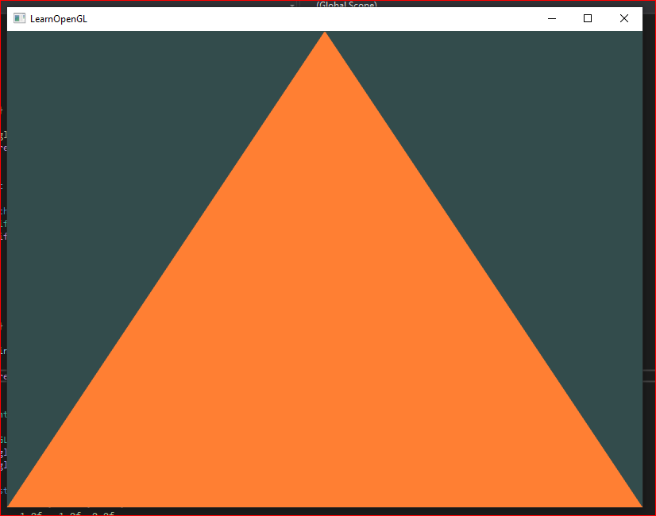
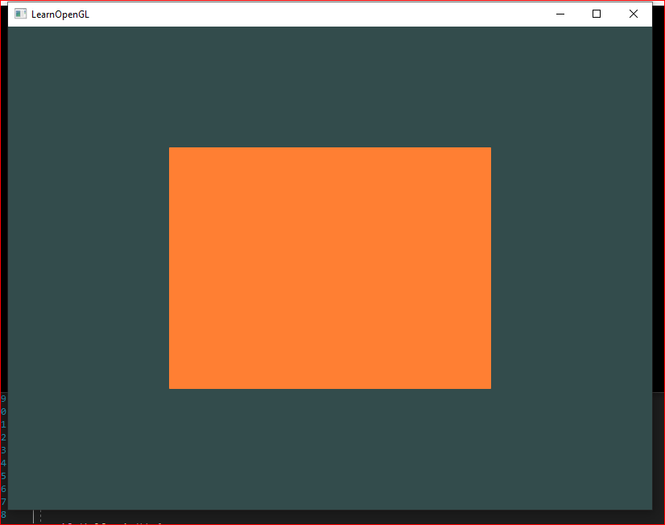
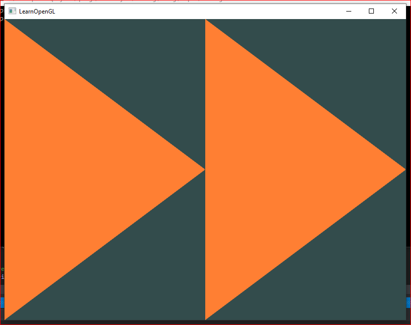

# Learning OPENGL 3.3

The purpose of this project is to learn OpenGL using C++. Will create a small game.

Required dependencies:

* glad: with opengl 3.3
* glfw-3.2.2

## Current Status

Draw a triangle, rectangle or 2 triangles using vertex and fragment shader. 
* With **a** key change triangle, rectangle or double triangle.
* With **space** key we can change the color.
* With **Esc** key you will exit the application.

